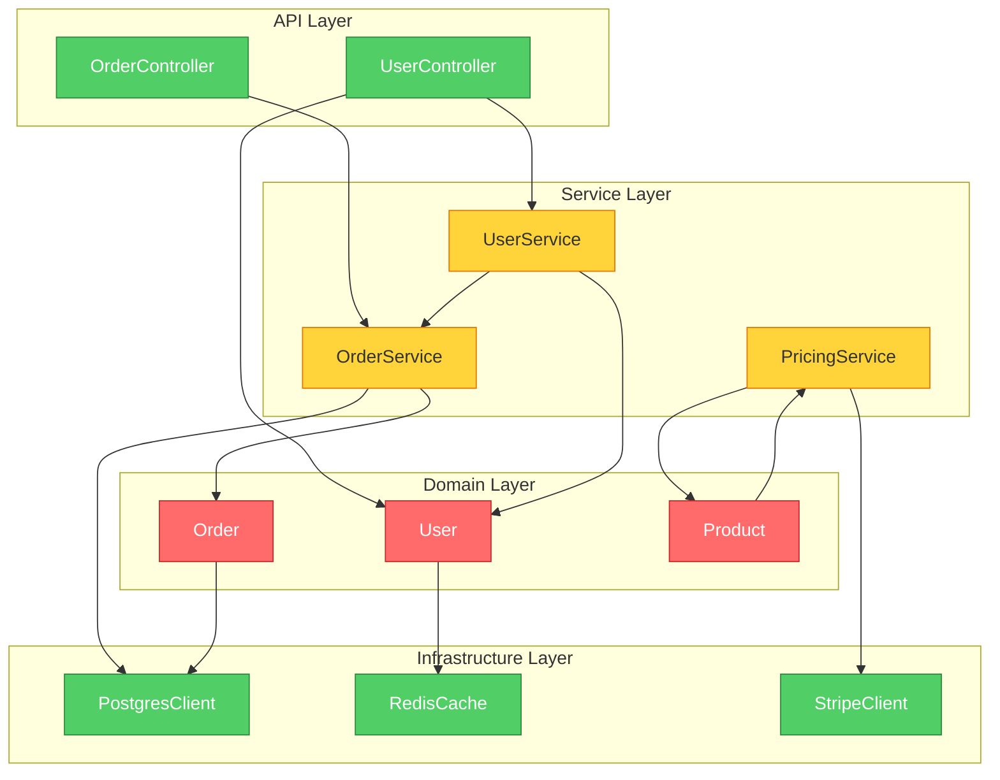
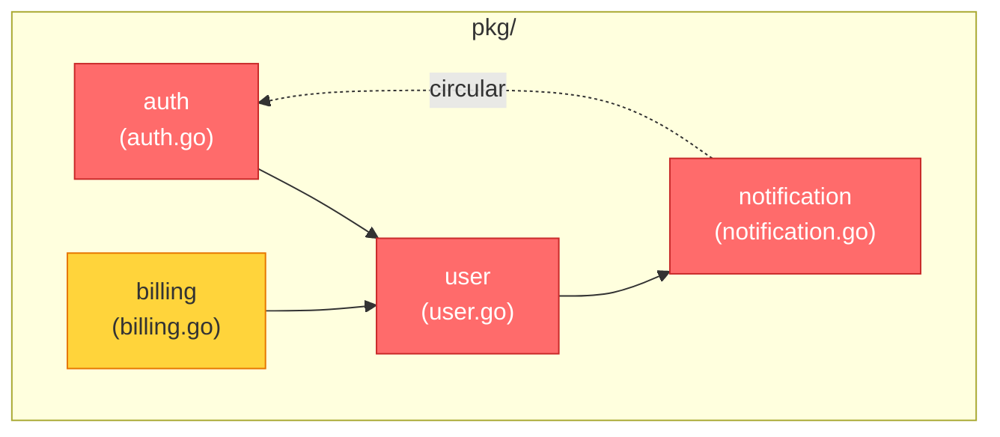
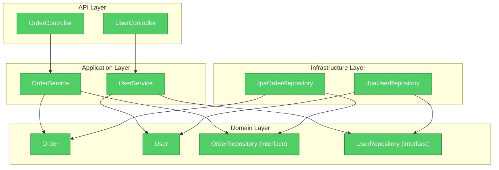

# brooks-lint Gallery

> Real output from brooks-lint on real-ish code. Examples were generated by running the skill, then lightly abridged — some `Consequence` lines trimmed to keep the page readable.

**Modes:** [PR Review](#pr-review-mode-1) | [Architecture Audit](#architecture-audit-mode-2) | [Tech Debt](#tech-debt-assessment-mode-3) | [Test Quality](#test-quality-review-mode-4)
*Health Dashboard (Mode 5) examples will land in a future update — it aggregates the other four.*

---

## PR Review (Mode 1)

### TypeScript — Change Propagation (Critical)

<details>
<summary>Input code</summary>

```typescript
class PaymentProcessor {
  constructor(
    private db: Database,
    private stripe: StripeClient,
    private mailer: MailService,
    private inventory: InventoryService,
    private analytics: AnalyticsService,
    private taxCalc: TaxCalculator,
    private fraudDetection: FraudService
  ) {}

  async processPayment(orderId: string, cardToken: string): Promise<PaymentResult> {
    const order = await this.db.orders.findById(orderId);
    const tax = this.taxCalc.calculate(order.items, order.shippingAddress.state);
    order.tax = tax;

    const fraudScore = await this.fraudDetection.evaluate({
      amount: order.total + tax, card: cardToken,
      email: order.customerEmail, ip: order.metadata.clientIp
    });
    if (fraudScore > 0.8) {
      await this.mailer.send(order.customerEmail, 'Order Held', 'Your order is under review.');
      await this.analytics.track('fraud_hold', { orderId, score: fraudScore });
      return { status: 'held', reason: 'fraud_review' };
    }

    const charge = await this.stripe.charges.create({
      amount: Math.round((order.total + tax) * 100), currency: 'usd', source: cardToken
    });

    for (const item of order.items) {
      await this.inventory.decrement(item.sku, item.quantity);
      if (await this.inventory.getStock(item.sku) < 10) {
        await this.mailer.send('warehouse@company.com', 'Low Stock', `SKU ${item.sku} below threshold`);
      }
    }

    order.status = 'paid';
    order.chargeId = charge.id;
    await this.db.orders.save(order);
    await this.mailer.send(order.customerEmail, 'Payment Received', `Charge: $${order.total + tax}`);
    await this.analytics.track('payment_success', { orderId, amount: order.total + tax });
    return { status: 'paid', chargeId: charge.id };
  }
}
```

</details>

**Health Score: 55/100**

*This method orchestrates seven different services in a single function, creating a structural coupling trap where any change to payment, fraud, inventory, or notification behaviour requires modifying the same method.*

#### 🔴 Change Propagation — Seven-service constructor signals a God Class in formation

**Symptom:** `PaymentProcessor` injects seven dependencies (`db`, `stripe`, `mailer`, `inventory`, `analytics`, `taxCalc`, `fraudDetection`) into a single class. The single `processPayment` method directly orchestrates all seven.
**Source:** Fowler — *Refactoring* — Divergent Change; Martin — *Clean Architecture* — Single Responsibility Principle
**Consequence:** This class will change for at least four independent reasons: fraud policy changes, inventory logic changes, tax rule changes, and notification content changes. Each change is a merge conflict waiting to happen.
**Remedy:** Decompose into focused collaborators. Introduce a `FraudCheckService`, an `InventoryDeductionService`, and a `PaymentNotifier`. `PaymentProcessor` then injects 3 services, not 7.

#### 🔴 Change Propagation — Inventory loop embeds warehouse notification policy

**Symptom:** Inside the `for` loop, a low-stock threshold check (`< 10`) triggers a warehouse email with a hardcoded recipient and threshold. This mixes inventory decrement logic with notification policy in a payment method.
**Source:** Fowler — *Refactoring* — Shotgun Surgery; Hunt & Thomas — *The Pragmatic Programmer* — Ch. 2: Orthogonality
**Consequence:** Changing the low-stock threshold, the warehouse email address, or the notification channel requires modifying `processPayment`.
**Remedy:** Move the post-decrement stock check into `InventoryService.decrement()`, or publish a domain event (`StockLevelChanged`) that a separate `WarehouseNotificationService` subscribes to.

#### 🟡 Knowledge Duplication — `order.total + tax` computed three times

**Symptom:** The expression `order.total + tax` appears on three separate lines with no shared name.
**Source:** Hunt & Thomas — *The Pragmatic Programmer* — DRY; Fowler — *Refactoring* — Duplicate Code
**Consequence:** If tax calculation logic changes, all three sites must be updated in sync. Missing one produces a financial inconsistency bug.
**Remedy:** Assign `const totalWithTax = order.total + tax;` immediately after tax calculation. Better still, let `Order` expose a computed `get grandTotal()` property.

#### 🟡 Domain Model Distortion — `Order` is a mutable data bag

**Symptom:** `order.tax = tax`, `order.status = 'paid'`, `order.chargeId = charge.id` are all set externally. The `Order` object holds no behavior.
**Source:** Evans — *Domain-Driven Design* — Domain Model pattern; Fowler — *Refactoring* — Data Class
**Remedy:** Give `Order` methods that encode state transitions: `order.recordPayment(chargeId)`.

---

## Architecture Audit (Mode 2)

### TypeScript — Dependency Inversion Violation

<details>
<summary>Input structure</summary>

```
src/
├── domain/
│   ├── Order.ts           # imports from ../infra/PostgresClient
│   ├── User.ts            # imports from ../infra/RedisCache
│   └── Product.ts         # imports from ../services/PricingService
├── services/
│   ├── OrderService.ts    # imports from ../domain/Order, ../infra/PostgresClient
│   ├── PricingService.ts  # imports from ../domain/Product, ../infra/StripeClient
│   └── UserService.ts     # imports from ../domain/User, ../services/OrderService
├── infra/
│   ├── PostgresClient.ts, RedisCache.ts, StripeClient.ts
└── api/
    ├── OrderController.ts # imports from ../services/OrderService
    └── UserController.ts  # imports from ../services/UserService, ../domain/User
```

</details>

**Health Score: 50/100**



#### 🔴 Dependency Disorder — Domain layer directly imports infrastructure

**Symptom:** `Order.ts` imports `PostgresClient`; `User.ts` imports `RedisCache`. Domain entities carry outbound arrows into Infrastructure.
**Source:** Martin — *Clean Architecture* — Dependency Inversion Principle (DIP)
**Consequence:** Every time the database driver changes its API, domain entities must be modified. Swapping PostgreSQL requires editing business-domain objects.
**Remedy:** Define repository interfaces (`IOrderRepository`, `IUserRepository`) inside the domain layer. Move all infra references into `infra/` implementations.

#### 🔴 Dependency Disorder — Product → PricingService (upward dependency)

**Symptom:** `Product.ts` imports `PricingService`, creating a near-cycle: `PricingService → Product → PricingService`.
**Source:** Martin — *Clean Architecture* — Acyclic Dependencies Principle (ADP)
**Consequence:** Impossible to instantiate or test `Product` without the entire pricing service infrastructure.
**Remedy:** Remove the import. Pass pricing as a value object or define `IPricingPolicy` in the domain layer.

---

### Go — Circular Dependency

<details>
<summary>Input structure</summary>

```
pkg/
├── auth/auth.go          # imports pkg/user
├── user/user.go          # imports pkg/notification
├── notification/notification.go  # imports pkg/auth
└── billing/billing.go    # imports pkg/user
```

auth → user → notification → auth forms a cycle.

</details>

**Health Score: 45/100**



#### 🔴 Dependency Disorder — Circular dependency: auth → user → notification → auth

**Symptom:** Three packages form a strongly connected component. Go's compiler will refuse to compile this.
**Source:** Martin — *Clean Architecture* — Acyclic Dependencies Principle (ADP)
**Consequence:** None of the three packages can be compiled, tested, or deployed independently.
**Remedy:** Extract interfaces into `pkg/contracts`: `UserLookup` (for auth), `PermissionChecker` (for notification), `Notifier` (for user). Each package implements the interface defined by its consumer.

#### 🟡 Domain Model Distortion — Bounded context crossed without anti-corruption layer

**Symptom:** Three distinct bounded contexts (identity, user profile, notification) import each other directly with no translation layer.
**Source:** Evans — *Domain-Driven Design* — Bounded Context; Anti-Corruption Layer
**Remedy:** Define thin adapters at each context boundary.

---

### Java — Clean Architecture (No Major Findings)

<details>
<summary>Input structure</summary>

```
src/main/java/com/example/
├── domain/
│   ├── model/       Order.java, User.java (no external imports)
│   └── port/        OrderRepository.java, UserRepository.java (interfaces)
├── application/     OrderService.java, UserService.java (imports domain only)
├── infra/           JpaOrderRepository.java, JpaUserRepository.java (implements ports)
└── api/             OrderController.java, UserController.java (imports application)
```

</details>

**Health Score: 98/100**



No critical or warning findings. Dependencies flow inward: `api → application → domain`; `infra` implements domain ports (DIP). No cycles. Textbook Clean Architecture.

#### 🟢 Suggestion — Monitor application service growth

**Symptom:** `OrderService` and `UserService` are symmetric siblings. As the system grows, both may accumulate responsibilities without a clear split policy.
**Source:** Brooks — *The Mythical Man-Month* — Conceptual Integrity
**Remedy:** Document a "one service per use case cluster" rule now, before the pattern calcifies.

---

## Tech Debt Assessment (Mode 3)

### Java — Shotgun Surgery Across Six Files

<details>
<summary>Input code</summary>

```java
// PriceFormatter.java
public String format(double amount) { return String.format("$%.2f", amount); }

// InvoiceGenerator.java
public String generateLine(Item item) { return item.getName() + " - $" + String.format("%.2f", item.getPrice()); }

// ReportExporter.java
public void exportRow(CsvWriter writer, Transaction tx) { writer.write(tx.getId(), "$" + tx.getAmount(), tx.getDate()); }

// EmailTemplateRenderer.java
public String renderTotal(Order order) { return "<strong>Total: $" + order.getTotal() + "</strong>"; }

// TaxCalculator.java — US-only tax rates hardcoded

// RefundService.java
public String processRefund(Payment p) { return "Refunded $" + p.getAmount() + " to card ending " + p.getLast4(); }
```

</details>

**Health Score: 56/100**

#### Debt Summary Table

| Risk | Findings | Avg Priority | Classification |
|------|----------|-------------|----------------|
| Change Propagation | 2 | 6.5 | Mixed (1 Critical + 1 Scheduled) |
| Knowledge Duplication | 1 | 9.0 | Critical |
| Domain Model Distortion | 1 | 9.0 | Critical |
| Cognitive Overload | 1 | 6.0 | Scheduled |

#### 🔴 Change Propagation — Shotgun Surgery across six modules (Pain × Spread: 9)

**Symptom:** Adding EUR requires editing 6 files in 6 distinct layers that have no architectural relationship.
**Source:** Fowler — *Refactoring* — Shotgun Surgery; Hunt & Thomas — *The Pragmatic Programmer* — Orthogonality
**Remedy:** Introduce a `Money` value object (amount + Currency enum) and a `MoneyFormatter` service. All six classes receive `Money` and delegate rendering.

#### 🔴 Knowledge Duplication — `$` duplicated as magic literal in five files (Pain × Spread: 9)

**Symptom:** The string `"$"` appears in 5 independent locations with no shared constant.
**Source:** Hunt & Thomas — *The Pragmatic Programmer* — DRY; McConnell — *Code Complete* — Ch. 12
**Remedy:** Use `java.util.Currency.getSymbol(Locale)` in `MoneyFormatter`. Remove all `"$"` literals.

#### 🔴 Domain Model Distortion — No `Money` type exists (Pain × Spread: 9)

**Symptom:** All price/amount fields are raw `double`. No `Money`, `MonetaryAmount`, or `Price` type anywhere.
**Source:** Evans — *Domain-Driven Design* — Domain Model pattern; Fowler — *Refactoring* — Data Class
**Remedy:** Introduce `record Money(BigDecimal amount, Currency currency)`. Replace all `double` price fields.

**Recommended focus:** All three Critical findings share the same root cause — the absence of a `Money` value object. One intervention collapses three findings.

---

## Test Quality Review (Mode 4)

### TypeScript — Mock Abuse

<details>
<summary>Input code</summary>

```typescript
describe('OrderService.placeOrder', () => {
  it('should place an order successfully', () => {
    const mockDb = mock<Database>();
    const mockPayment = mock<PaymentGateway>();
    const mockInventory = mock<InventoryService>();
    const mockMailer = mock<MailService>();
    const mockAudit = mock<AuditLogger>();
    const mockCache = mock<CacheService>();
    const mockMetrics = mock<MetricsCollector>();
    // ... 7 mock setups ...
    const service = new OrderService(mockDb, mockPayment, mockInventory, mockMailer, mockAudit, mockCache, mockMetrics);
    const result = await service.placeOrder('1', 'item-1', 2);

    expect(mockPayment.charge).toHaveBeenCalledWith('ch_1', 2000);
    expect(mockInventory.check).toHaveBeenCalledWith('item-1', 2);
    expect(mockMailer.send).toHaveBeenCalled();
    expect(mockAudit.log).toHaveBeenCalledWith('ORDER_PLACED', expect.anything());
    expect(mockCache.invalidate).toHaveBeenCalledWith('orders:1');
    expect(mockMetrics.increment).toHaveBeenCalledWith('orders.placed');
  });
});
```

</details>

**Health Score: 60/100**

#### 🔴 Mock Abuse — Seven mocks per test; mock setup dominates test logic

**Symptom:** 7 mock objects; 14 lines of setup vs 6 lines of assertions. `OrderService` is never tested against any real collaborator.
**Source:** Osherove — *The Art of Unit Testing* — mock count > 3; Meszaros — *xUnit Test Patterns* — Behavior Verification
**Consequence:** The test is coupled to internal implementation. If `placeOrder` returns the wrong order ID or crashes on an edge case, this test will still pass because `result` is never examined.
**Remedy:** Reduce mocks to ≤ 3. Use in-memory fakes. Assert on `result` as the primary assertion.

#### 🔴 Mock Abuse — All six assertions verify mock calls, not observable behavior

**Symptom:** Every assertion is `expect(mock).toHaveBeenCalledWith(...)`. The return value `result` is captured but never asserted on.
**Source:** Meszaros — *xUnit Test Patterns* — Behavior Verification; Feathers — *Working Effectively with Legacy Code* — Sensing and Separation
**Consequence:** A `placeOrder` that calls every mock correctly but returns `null` or double-charges the customer will pass this test.
**Remedy:** Assert on observable outputs: `expect(result.status).toBe('confirmed')`. Retain at most one mock-call assertion for a critical side effect.

---

### Python — Inverted Test Pyramid

<details>
<summary>Input overview</summary>

```
tests/
├── e2e/           47 tests, avg 8s each (~6 min total)
├── integration/   83 tests, avg 2s each (~3 min total)
└── unit/          24 tests, avg 10ms each (~0.2s total)

Total: 154 tests, ~9 min execution time
Ratio (actual):  Unit 16% : Integration 54% : E2E 30%
Ratio (target):  Unit 70% : Integration 20% : E2E 10%
```

</details>

**Health Score: 55/100**

#### 🔴 Architecture Mismatch — Fully inverted test pyramid

**Symptom:** Only 24 of 154 tests (16%) are unit tests. E2E + integration = 84% of test count.
**Source:** Winters et al. — *Software Engineering at Google* — Ch. 16: Testing Overview (test portfolio balance); Meszaros — *xUnit Test Patterns* — test suite design
**Consequence:** CI takes ~9 minutes (~542s) per push. Slow feedback causes developers to push in batches, reducing commit granularity. The E2E layer is most likely to produce flaky failures.
**Remedy:** Target 70% unit. For each E2E file, identify core business logic and write unit tests. Reduce E2E to 5-8 critical smoke tests.

#### 🔴 Architecture Mismatch — 9-minute suite blocks CI fast-feedback

**Symptom:** Full suite ~542 seconds, dominated by E2E tests averaging 8s each.
**Source:** Meszaros — *xUnit Test Patterns*; Winters et al. — *Software Engineering at Google* — Ch. 16: Testing Overview
**Remedy:** Split CI into two stages: (1) unit tests only, < 60s, blocks merge; (2) integration + E2E, async non-blocking.

#### 🟡 Coverage Illusion — Core domain untested at unit level

**Symptom:** `tests/unit/` covers only validators and formatters. No unit tests for checkout, login, order, payment, search, or admin.
**Source:** Feathers — *Working Effectively with Legacy Code* — "Legacy code is code without tests"
**Remedy:** Start with `test_checkout_flow.py` and `test_payment_api.py` — extract business logic into unit tests.
